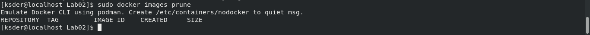

## Kacper Suder 408408
---
Sprawozdanie numer 1 - Git, Gałęzie, SSH, Docker
---
1. Przed pierwszymi zajęciami zainstalowano klienta Git:

	

2. Sklonowano repozytorium przy użyciu html:

	

3. Utworzono klucze ssh z opcją -f tworzącą go w aktualnie znajdującej się lokalizacji:

	

- w celu poprawności połączenia należało dodać identyfikator. Następnie sprawdzono poprawność połączenia:

	

4. Wygenerwano kolejne klucze, tym razem bez opcji -f. Zostały one zapisane w katalogu home/nazwa_użytkownika/.ssh, gdzie nazwa_użytkownika jest nazwą użytkownika generującego klucz. Dodano nowo wygenerowany klucz publiczny do Githuba:

	

- następnie sprawdzono poprawność połączenia z GitHub-em:

	

5. Skopiowano repozytorium przy użyciu SSH:

	

6. Utworzono i przełączono się na własną gałąź pod nazwą "KS408408", przy użyciu komendy "git checkout -b KS408408":

	

7. We właściwym katalogu dla grupy utworzono nowy katalog o nazwie "KS408408":

	

8. Napisano Git hook'a - Skrypt weryfikujący, czy każdy commit zaczyna się od "KS408408":

	

- W celu poprawnego działania, należało skopiować z katalogu ".git/hooks" przykładowy "commit-msg.sample" do katalogu "KS408408". Następnie edytowano plik w wyżej wymieniony sposób i zmieniono nazwę pliku w katalogu GCL6/KS408408 na commit-msg. Kopię pliku dodano do katalogu ".git/hooks".

10. Sprawdzono poprawność działania Git Hooka:

        

11. Utworzono plik ze sprawozdaniem i dodano zrzuty ekranu. Następnie wysłano aktualizację do zdalnego źródła:

	

12. Kolejne laboratoria rozpoczęto od dodania do konta na GitHubie uwierzetelnienia dwuetapowego:

        

13. Utworzono konto oraz zapoznano się z przykładowymi obrazami na DockerHubie:

        

14. Zainstalowano Dockera przy pomocy komendy "dnf install docker" podanego podczas zajęć przez prowadzącego (Dockera zainstalowano wcześniej, przy pomocy wcześniej wspomnianej komendy):

        

15.  Pobrano następujace obrazy:
---
	* hello-world:

        

	- Jak można zauważyć, Docker symulowany jest przez Podman-a, co nie ma jednak wpływu na jego działanie

---

	* busybox:

        

	- Uruchomiono busyboxa i sprawdzono efekt działania:

        

	- Podłączono się interaktywnie do kontenera i wywołano numeru sesji:

        

---

	* mysql:

        

 

        

        

---

	* Ubuntu:
	-Pobrano i uruchomiono obrazu Ubuntu:

        

	- PID1 w kontenerze:

        

	
	- Procesy dockera na hoście:

        

	- Aktualizacja pakietów:

        

	- Opuszczono kontener:

        

16. Napisano własny plik Dockerfile:

        

17. Zbudowano obraz:

        

18. Uruchomiono i sprawdzono poprawność pobrania repozytorium:

        

19. Wyświetono kontenery:

        

	- Wszystkie kontenery zostały wcześniej zatrzymane

20. Wyczyszczono obrazy:

        

        

21. Wystawiono Pull Request do gałęzi grupowej jako zgłoszenie wykonanego zadania:

        
        

